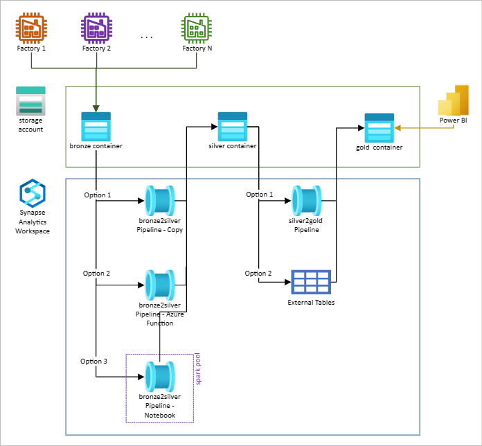

# Serverless Modern Data Warehouse Sample using Azure Synapse Analytics and Power BI

End-to-end sample of a serverless modern data warehouse data processing pipeline for Power BI visualization. This sample demonstrates how to build a scalable and efficient data pipeline using Azure Synapse Analytics, and how to visualize the results in Power BI.

__What's covered?__

- [Use Case](#use-case) - review the potential scenario for this sample.

- [Architecture Diagram](#architecture-diagram) - high level architecture diagram.

- [Working with this sample](#working-with-this-sample) - step by step instructions to deploy the sample.

- [A deeper view - Addtional Details and Considerations](#a-deeper-view---addtional-details-and-considerations)

- [Out of scope](#out-of-scope)


## Use Case

An organization with multiple factories and data models is looking for a cost-effective solution that will allow their analytical team to combine and analyze data from all the factories in a single report. The factories periodically upload data to a storage account, and the solution should be able to process this data and provide insights to the analytical team.

## Architecture Diagram



### Storage

The data lake is a storage account with hierarchical namespace that is used to store data files. The medalion concept is used to track the progress of data as it flows through the solution.

### Bronze to Silver

There are several ways to implement the Bronze to Silver data pipeline. In this example, we use Azure Data Factory to build the pipeline. The pipeline extracts data from the Bronze container, transforms it to the Silver schema, and stores it in the Silver container. The data is partitioned by factory, date, and data model.

We demonstrate three different methods for implementing this pipeline:

- Using a copy activity to copy the data from the Bronze container to the Silver container.

- Using an Azure Function to transform the data and store it in the Silver container.

- Using spark notebooks to transform the data and store it in the Silver container.

> Note: The spark approach requires the use of a Spark pool, which might not be considered as a serverless solution.

### Silver to Gold

In data warehousing, it is common to move data from the Silver to Gold containers. This process involves extracting data from the Silver container, transforming it to the Gold schema, and storing it in the Gold container. The data is partitioned based on specific business requirements.

There are two methods we can use to implement this pipeline: using a serverless stored procedure or using external tables. We demonstrate both methods in this example.

### Power BI


## Working with this sample

As part of this sample, we have included Bicep code that will deploy the minimum required Azure resources for the sample to run.

### Prerequisites

The following are the prerequisites for deploying this sample :

- [Azure CLI](https://docs.microsoft.com/en-us/dotnet/azure/install-azure-cli/)
- [Bicep](https://docs.microsoft.com/en-us/azure/azure-resource-manager/bicep/install/)
- [Power BI Desktop](https://powerbi.microsoft.com/en-gb/desktop/)

> Note: Using PowerBI is an optional way to visualize data.

### Deployment of the Azure resources

1. Create a resource group in Azure where the sample resources will be deployed.

1. Clone or fork this repository and navigate to the ```sample-mdw-serverless/deploy/bicep``` folder.

1. Open the ```param.json``` file and provide your own values for the parameters. The ```suffix``` parameter will be used to create unique names for the Synapse and storage instances in Azure, so make sure to choose a value that is not already in use. The default setup is for a publicly accessible solution, so the startIP and endIP parameters allow access to Synapse from any IP address.

1. Open a command line and run the following command to deploy the sample resources to Azure:
```az deployment group create --resource-group <your-resource-group-name> --template-file main.bicep --parameters @param.json```

This operation may take a few minutes to complete. Once it is finished, you can verify that the resources were created successfully by checking the resource group in the Azure portal.

### Setup Synapse worksape

1. Open the newly created Synapse workspace.

1. Point the Synapse workspace to the cloned/forked repository using the repository link as shown in this [document](https://docs.microsoft.com/en-us/azure/synapse-analytics/cicd/source-control).

1. In the Azure Synapse workspace, go to the Manage > Linked Services > medallion_storage > Parameters > suffix, and enter the same value that you used for the suffix parameter in the ```param.json``` file in the Bicep code. This will update the linked services and integration datasets that use the suffix value.

    

1. Run the 'Copy Data Samples' pipeline. This will copy the [control file](#control-table) and the [data samples](#sample-files) to your local repository. [See details.](#sample-files)
     > Note: You can use the ```Debug``` to get started quickly, or setup a trigger as described [here](https://docs.microsoft.com/en-us/azure/data-factory/concepts-pipeline-execution-triggers).

1. Run the 'bronze2silver - Copy' pipeline. This will run the Bronze to Silver transformations per factory and per data model. [See details.](#bronze-to-silver-pipeline)

1. Go to Develop > SQL Scrips > Factories and open the ```InitDB``` script.

1. Run the first commands against the ```master``` database.

1. Run the remaining commands by order against the newly created DB. [See details.](#silver-to-gold-pipeline)

1. Open the ```Create-External-Tables``` script, replace the ```suffix``` with the value you used throughout the sample and the ```SAS token``` to access your storage account and run the commands by order. This will create your gold tables.

1. Open Power BI Desktop and follow the steps in this [document](https://docs.microsoft.com/en-us/power-apps/maker/data-platform/export-to-data-lake-data-powerbi#prerequisites) to connect your Gold Data Lake storage to Power BI Desktop to visualize de data.

1. Optionally, you can also set up an automated DevOps pipeline using [these instructions](./deploy/DevOps/README.md).

## A deeper view - Addtional Details and Considerations

### Storage account

### Sample files

The sample files consist of daily dropped data in zip format. Each zip file contains a data file with a JSON per line.

```JSON
{"dataModelName":"data_model_1","operation":"U","factory":1354010702,"lineId":14871,"date":"2022-06-22T00:00:00","feature1":1,"dim":73,"yield":37307}
{"dataModelName":"data_model_1","operation":"U","factory":1354010702,"lineId":14872,"date":"2022-06-22T00:00:00","feature1":1,"dim":73,"yield":37306}
{"dataModelName":"data_model_1","operation":"U","factory":1354010702,"lineId":14873,"date":"2022-06-23T00:00:00","feature1":1,"dim":73,"yield":37305}
```

### Control Table

A control table is used to store information about the data uploaded into browse layer. This table stores the location of all the uploaded files per factory, the data model, uploaded date and if the file was already processed or not.

FactoryID | DataModelName | FileLocation | UpdateDate | Processed
---|---|--- |--- |---
1354010702 | data_model_1 | factory=1354010702/dataModelName=data_model_1/y=2022/m=06/d=25| 2022-06-25 | false
1354010702 | data_model_2 | factory=1354010702/dataModelName=data_model_2/y=2022/m=06/d=25| 2022-06-25 | true
1353534654 | data_model_1 | factory=1353534654/dataModelName=data_model_1/y=2022/m=06/d=26| 2022-06-26 | true
... | ... | ... | ... | ...

Every time a new file lands in the bronze layer, or it is processed, this table must be automatically updated by another process (out of scope for this sample).

> Note: To keep this sample simple, the control information was hardcoded in a JSON file named dropped_files.json (manual edit to the control JSON file can be done directly from the portal). However, for production this is an anti-pattern and we strongly advise using a metadata table and a process to automatically update it.

### Bronze to Silver Pipeline

In the bronze2silver pipelines, a Lookup activity will read the control table entries.
Then a ForEach activity, per data model, will iterate over all entries of the control table. Inside the ForEach, a IfCondition activity will filter all unprocessed files. For each unprocessed file, a Copy, a Notebook or an Azure Function activity will be executed. All these three option are explained in more detail in the next sections. We encourage you to use the pipeline that best suits your requirements. Please evaluate the available options and choose the one that meets your needs and goals in the most effective way.

All the different bronze2silver pipelines are storing the files in the silver container in the parquet format, and preserving the original directory structure. The parquet files can be queried using Synapse Serverless SQL Pool. For example, you could use the following query to access the data stored in the silver container:

```sql
select * 
FROM
    OPENROWSET(
        BULK 'https://<storage-account-name>.dfs.core.windows.net/<container>/<folder>/**',
        FORMAT = 'PARQUET'
    ) AS [result]
```

#### Copy Activity - Pipeline 'bron2silver - Copy'

This pipeline leverages a Copy activity to copy the files from bronze to silver container.


There is a ForEach activity for each of the data models. Inside each ForEach activity, there is an IfCondition activity that filters the data records that have not yet been processed. The unprocessed data records are then copied to the sink container by applying minimal business logic using the Mapping tab of the Copy activity.

##### Copy activity Mapping

In order to extract the nested JSON values, you will need to map them to a type in the Mapping tab of the Copy activity. Each type of file will require its own mapping, which can be time-consuming but is necessary to ensure that all necessary fields are assigned the correct type and saved during the sink operation. Additionally, you can use the Mapping tab to add additional fields, such as calculated or derived fields, to the data.


#### Azure Function - Pipeline 'bron2silver - Azure Function'

If you need to apply business logic to your data before storing it to the silver container, we encourage you to leverage an azure function.
The sample code, executed by the Azure Function, includes an example of how to move files to different target directories based on the Date value inside the files. This can be useful for organizing your data and making it easier to access later.

Read more on this function [here](./functions/getting_started.md).

When calling the Azure Function activity, you would need to define the following POST payload defined. Under the Settings of the function insert the following dynamic content, in the Body field.

```
@concat('{',
        '"file_name"',':','"',item().FileLocation,'/daily.zip"', ',',
        '"source_container"',':','"',pipeline().parameters.source_container,'"', ',',
        '"target_cs"',':','"',pipeline().parameters.target_container,'"', ',',
        '"source_cs"',':','"',activity('Get CS from AKV').output.value,'"', ',',
        '"target_cs"',':','"',activity('Get CS from AKV').output.value,'"',
        '}'
        )
```

#### Notebook (Spark Pool) - Pipeline 'bronze2silver - Notebook'

In alternative to the Copy and Azure Function activities, you can leverage a Notebook activity to move large amounts of data. The sample code, inside the Notebook, includes an example of how to move files to different target directories based on the Date value.

> Note: This option will require you to create a Spark Pool.
  
### Silver to Gold Pipeline

The silver to gold pipeline is the process that creates the files in the gold container to then be visualized in Power BI. This is achieved by leveraging the serverless SQL pool. In order to create the gold files, we will explore in more detail the following options: using a serverless stored procedure or using external tables. Overall, both options provide a way to create the gold tables within the database using the data that is generated in the silver to gold pipeline. The choice between using a serverless store procedure or external tables would depend on the specific requirements and constraints of your application.

#### Serverless Stored Procedure or Copy Activity - Pipeline 'silver2gold'

In the silver to gold pipeline, a copy activity or a serverless store procedure activity is used to create the gold tables. The copy activity uses a query to aggregate data from the silver tables and insert it into the gold tables, while the serverless store procedure activity executes the necessary SQL commands to define and populate the gold tables. A control table is used to build the aggregations queries to be performed by the pipeline. This information is used by both approaches.

#### External tables - SQL scripts

An [external table](https://docs.microsoft.com/en-us/azure/synapse-analytics/sql/develop-tables-cetas) is a table that is defined within the database, but the data for the table is stored outside of the database in a flat file. In the case of the silver to gold pipeline, the files that are created in the gold container. This would allow the database to access and query the data in the gold container as if it were a regular table within the database.

Overall, both options provide a way to create the gold tables within the database using the data that is generated in the silver to gold pipeline. The choice between using a serverless store procedure or external tables would depend on the specific requirements and constraints of the system.

##### Create a database, master key & scoped credentials

The following script provides a way to create a database and the necessary security components and can be found under Develop > SQL scripts > factories > InitDB:

```sql
-- Create a DB
CREATE DATABASE <db_name>
-- Create Master Key (if not already created)
CREATE MASTER KEY ENCRYPTION BY PASSWORD = '<password>';
-- Create credentials
CREATE DATABASE SCOPED CREDENTIAL [factories_cred]
WITH IDENTITY='SHARED ACCESS SIGNATURE',  
SECRET = ''
```

If you want to create SAS tokens for your Azure storage containers, you can follow the steps provided in the linked [section](https://learn.microsoft.com/en-us/azure/cognitive-services/translator/document-translation/create-sas-tokens?tabs=Containers#create-sas-tokens-in-the-azure-portal).


#### Create External File Format

The script provided bellow, is used to create an external file format. An external file format defines the format, structure, and encoding of data stored in external files. In this case, the script creates an external file format named SynapseParquetFormat with the format type set to PARQUET.

```sql
IF NOT EXISTS (SELECT * FROM sys.external_file_formats WHERE name = 'SynapseParquetFormat') 
    CREATE EXTERNAL FILE FORMAT [SynapseParquetFormat] 
    WITH ( FORMAT_TYPE = PARQUET)
GO
```

#### Create External Source

The script provided below, is used to create an external data source. An external data source defines a connection to data stored outside of the database in an external location, such as a container in storage account. In this case, the script creates an external data source named gold that points to the specified gold container in an Azure storage account.

```sql
IF NOT EXISTS (SELECT * FROM sys.external_data_sources WHERE name = 'gold') 
    CREATE EXTERNAL DATA SOURCE [gold] 
        WITH (
            LOCATION = 'abfss://<gold container>@<storage account>.dfs.core.windows.net' 
        )
GO
```

#### Create External Table

The script provided below, is used to create an external table. An external table is a table that is defined within the database, but the data for the table is stored outside of the database in an external location. In this case, the script creates an external table named table_name that is populated with data from the specified location within the gold container in the storage account.

```sql
CREATE EXTERNAL TABLE table_name
    WITH (
        LOCATION = '<specific location within the gold container>/',  
        DATA_SOURCE = [gold],
        FILE_FORMAT = [SynapseParquetFormat]  
)
    AS 
    select * 
    FROM
    OPENROWSET(
        BULK 'https://<storage account>.dfs.core.windows.net/<silver container>/<folder>/**',
        FORMAT = 'PARQUET'
    ) AS [result]

```

## Out of scope

The following are out of scope for this sample:

- The mechanism that authenticates the factories and allows them to upload data to the storage account, as well as the mechanism that controls which files have been processed, are out of scope for this sample. We recommend creating separate components for authentication and authorization, and for tracking the files to be processed.

- Highly secured topology is out of scope for this sample. 

- Droped files control table is out of scope for this sample.