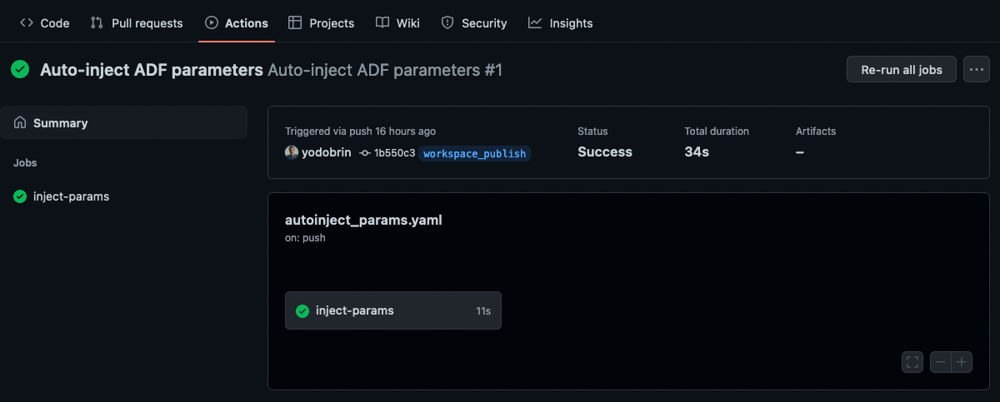

# Automated CI/CD Pipeline

The goal behind the automation of the CI/CD pipeline is to be able
to spread the Synapse Analytics Pipeline in different environments
with the ability to override the parameters used by the pipeline.
These parameters are used both in the pipeline itself _and_ the
initialization SQL scripts that are triggered in the workspace.

To date, Azure Synapse Analytics doesn't support the interpolation
of parameters in workspace initialization scripts. For this reason,
this repository includes a custom GitHub Workflow that scans for
references to parameters (with the `@parameters('key')` notation)
in the pipeline's ARM template and dynamically adds them to the
parameters file. This automation allows you to spread the pipeline
in new environments (e.g., Test -> Staging -> Prod) while ensuring
all parameter substitutions are respected.

## Copy the Workflow Files to the Publish Branch

After you run and publish the pipeline from Azure Synapse Analytics,
and assuming you've linked the Synapse Analytics workspace to the
GitHub repository, a new branch named `workspace_publish` should be
created automatically. This branch includes the ARM templates that
Azure Synapse Analytics needs in order to synchronize the state of
the pipeline with the GitHub repository.

In order for the automation to work, you'll need to copy two files
from the `main` branch to the automatically created
`workspace_publish` branch:

1. [`./scripts/autoinject_params.py`](../scripts/autoinject_params.py):
   This Python script is executed by a GitHub workflow each time
   a commit is pushed to the `workspace_publish` branch.
2. [`./.github/workflows/autoinject_params.yaml`](../.github/workflows/autoinject_params.yaml):
   This is the GitHub Workflow definition that executes the Python
   script and eventually commits the changes to the same branch.

You can create the files manually in the `workspace_publish` branch,
or alternatively, use your Git client to cherry-pick the files from
the `main` branch in the following way:

```shell
# Ensure you're up to date with the upstream repository:
git pull

# Ensure you're on "workspace_publish" branch:
git checkout workspace_publish

# Copy the files 
git checkout main ./scripts/autoinject_params.py
git checkout main ./.github/workflows/autoinject_params.yaml

# Stage, commit, and push the changes to the upstream GitHub repo:
git add .
git commit -m "Add automation workflow"
git push origin workspace_publish
```

## Validate the Workflow

 
The name of the directory under the `workspace_publish` branch that
Azure Synapse Analytics will create is derived from the workspace name
(e.g., `./medalionsynapse12`).

If the directory created under that branch has a different name, you will
need to change the values of the environment variables in the GitHub
Workflow (`./.github/workflows/autoinject_params.yaml`), e.g.:

```yaml
env:
  TEMPLATE_FILE: ./<TEMPLATES DIRECTORY>/TemplateForWorkspace.json
  PARAM_FILE: ./<TEMPLATES DIRECTORY>/TemplateParametersForWorkspace.json
  OUTPUT_FILE: ./injected_params/MedalionParams.json
```

## Test the changes

Once you've pushed the two automation files to the `workspace_publish`
branch, any change to the pipeline that you publish from Azure
Synapse Analytics will trigger the GitHub Action that's derived from
the workflow you've copied. To validate the success of the workflow,
navigate to the **Actions** tab in the GitHub repository and observe
the status of the Action run:


